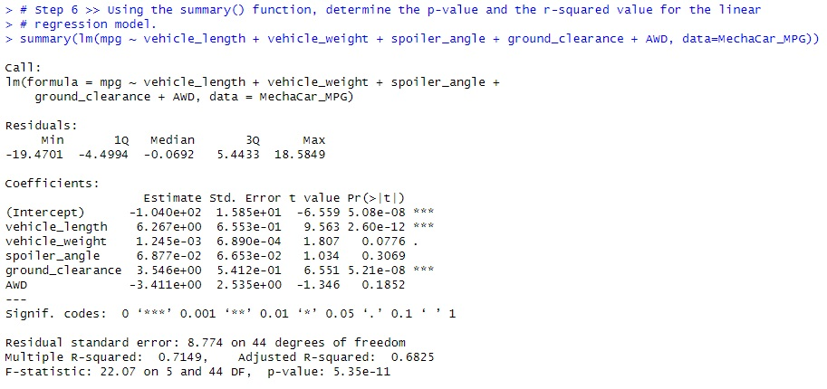

# MechaCar_Statistical_Analysis
Module 16 Challenge - Statistical Analysis using R

## Resources
Operating Platform: Windows 11 Pro [Buy Windows 11 Pro](https://www.microsoft.com/en-us/d/windows-11-pro/dg7gmgf0d8h4?rtc=1) Build 22621 
IDE Software: [RStudio](https://posit.co/download/rstudio-desktop/) Build 353 2022.12.0 () 
R Build Version: [Windows R version 4.2.2](https://cran.r-project.org/bin/windows/base/) 
R Specific Package: [Tidyverse](https://www.tidyverse.org/) 
Completed R Scripts: [MechaCar](MechaCarChallenge.RScript.R) 
Resource files: [MechaCar MPG](MechaCar_mpg.csv), [Suspension Coil](Suspension_Coil.csv)

## Overview
A fictious company AutosRUs' has created a new prototype car named "MechaCar" and they are running into a few production issues. Using a variety of R scripts and statistical analysis the following will be used to help determine a variety of questions and accomplish the below tasks:
* Perform multiple linear regression analysis to identify which variables in the dataset predict the mpg of MechaCar prototypes.
* Collect summary statistics on the pounds per square inch (PSI) of the suspension coils from the manufacturing lots.
* Run t-tests to determine if the manufacturing lots are statistically different from the mean population.
* Design a statistical study to compare vehicle performance of the MechaCar vehicles against vehicles from other manufacturers.

## Linear Regression to Predict MPG

<b>Which variables/coefficients provided a non-random amount of variance to the mpg values in the dataset?</b> 
  
The two coefficients which provided a non-random amount of variance are the Vehicle Length (P-Value 2.60e-12) & Ground Clearance (P-Value 5.21e-08.) These two values will have an impact on the MPG (Miles Per Gallon) of the prototype MechaCar. The remaining variables Vehicle Weight (P-Value 0.0776), Spoiler Angle (P-Value 0.3069), & AWD (P-Value 0.1852) do not have a non-random impact to the cars overall MPG. 

<b>Is the slope of the linear model considered to be zero? Why or why not?</b> 
The slope of this specific model is not less than zero (p-value: 5.35e-11) and is smaller than the standardized value of 5% (.05) 

<b>Does this linear model predict mpg of MechaCar prototypes effectively? Why or why not?</b> 
Additional research needs to be completed in order to determine the key factors as to predicting the MPG of the MechaCar. Below further data is provided to help determine this value. 

## Summary Statistics on Suspension Coils
<b>The design specifications for the MechaCar suspension coils dictate that the variance of the suspension coils must not exceed 100 pounds per square inch. Does the current manufacturing data meet this design specification for all manufacturing lots in total and each lot individually? Why or why not?</b> 
The current manufacturing for the suspension coils is within the threshold of 100 pounds per square inch (62.29356).
  
There are three different lots which have been manufactured, Lot1 and Lot2 are within the Variance threshold (0.9795918 & 7.4693878 respectfully) however Lot3 has a Variance (170.2861224) outside the threshold which is cause for greater research. This will need to be address and corrected in order to maintain the requested limits of < 100 PSI.
  

## T-Tests on Suspension Coils
Briefly summarize your interpretation and findings for the t-test results. Include screenshots of the t-test to support your summary. 

Lot 1 has the tightest manufacturing tolerances out of the 3 Lots. Using the below t.test results it shows that 95% of the results were within the threshold of 14.99.719 & 1500.281. This means that the lowest measures PSI range was 1498 and highest was 1502 giving a swing of 4 PSI between the two results. 
  

Lot 2 had the 2nd "best" results out of the 3 Lots. Using the below t.test results it shows that 95% of the results were within the threshold of 14.99.423 & 1500.977. This means that the lowest measured PSI range was 1494 and the highest being 1506 giving a 12 PSI swing. 
  

Lot 3 had the worst results between all 3 Lots. Using the below t.test results it shows that 95% of the results were within the threshold limits of 1492.431 & 1499.849. This results in the highest max PSI record of 1542 and the lowest PSI record of 1452 which is a swing of 90 PSI. This Lot should have additional research into the manufacturing practices and steps used to complete this batch of products. Because the results are outside the ranges of the other two lots it could have a greater impact on MPG or overall safety of the MechaCar.
  

## Study Design: MechaCar vs Competition
Write a short description of a statistical study that can quantify how the MechaCar performs against the competition. In your study design, think critically about what metrics would be of interest to a consumer: for a few examples, cost, city or highway fuel efficiency, horse power, maintenance cost, or safety rating.
In your description, address the following questions: 
 <b>What metric or metrics are you going to test?</b> 
There are several metrics which can be used to help the success of the MechaCar. Determining the final vehicle details will help determine which competitor cars to validate the value of the MechaCar. The engine size, drive train (AWD, 2WD, etc), & body style (sedan, SUV, sports car, etc) are a few to name. Once the details are confirmed then other data sources can be gathered as needed to compare the final product specs vs a similar competitive vehicle. I.E. validating the engine size vs the MPG vehiles inside the same class type.  
 <b>What is the null hypothesis or alternative hypothesis?</b> 
The null hypothesis would be that the MechaCar MPG is impacted by the engine size. 
The alternative hypothesis would be that there is not a significant impact of the MPG vs the competitors vehicles. /br>
 <b>What statistical test would you use to test the hypothesis? And why?</b> 
A few tests to validate is use a few key vehicle metrics to ensure the proper test parameters are used to ensure the MechaCar is best is class. Knowing the engine size, drivetrain, and class are three metrics to validate the standing of the final product. With enough datapoints I would use a two-sample t-test as I would hope to be able to compare the MechaCar vs 35 to 45 other manufactured vehicles.  
 <b>What data is needed to run the statistical test?</b> 
The data can be gathered by a variety of sources, web scrapping the data from each car manufactures website or using standardized data from NTSB (National Transportation Safety Board), BTS (Bureau of Transportation Statistics), KBB (KellyBlueBook.com if pricing or resale is a factor). From there gather the metrics to run the two sample t-test would be needed by using the data frames. 
